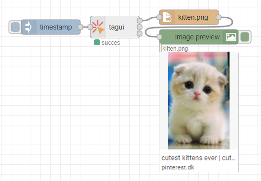

### TagUI nodered nodes

Easy wrapper for executing TagUI Scripts. Requires chrome to already be installed.

Check the headless option if run from inside docker or as a service.

Does not support running as root.

Node has 3 output nodes.
The top output node is used to continue the flow, once TagUI is done processing. msg.payload will contain all the output from the script
The second output node will receive all output from TagUI live. Use full for debugging
The last output node will trigger incase TagUI returns a non zero exit code, ie an error happend



requires [node-red-contrib-image-output](https://flows.nodered.org/node/node-red-contrib-image-output) for image result

```json
[{"id":"f3af1605.ec32f8","type":"inject","z":"cbfd3c06171c48cf","name":"","props":[{"p":"payload"},{"p":"topic","vt":"str"}],"repeat":"","crontab":"","once":false,"onceDelay":0.1,"topic":"","payload":"kitten","payloadType":"str","x":250,"y":180,"wires":[["7dd22cb.07c64d4"]]},{"id":"db71650e.26fae8","type":"image","z":"cbfd3c06171c48cf","name":"","width":"160","data":"payload","dataType":"msg","thumbnail":false,"active":true,"pass":false,"outputs":0,"x":820,"y":180,"wires":[]},{"id":"b70aac26.17577","type":"file in","z":"cbfd3c06171c48cf","name":"","filename":"data/kitten.png","format":"","chunk":false,"sendError":false,"encoding":"none","x":620,"y":180,"wires":[["db71650e.26fae8"]]},{"id":"8f0c45bc.efe9e8","type":"inject","z":"cbfd3c06171c48cf","name":"","props":[{"p":"payload"},{"p":"topic","vt":"str"}],"repeat":"","crontab":"","once":false,"onceDelay":0.1,"topic":"","payload":"puppies","payloadType":"str","x":250,"y":220,"wires":[["7dd22cb.07c64d4"]]},{"id":"da8f73d9.56c67","type":"comment","z":"cbfd3c06171c48cf","name":"TagUI version","info":"requires chrome to be preinstalled.","x":230,"y":140,"wires":[]},{"id":"7dd22cb.07c64d4","type":"tagui tagui","z":"cbfd3c06171c48cf","name":"","headless":true,"nobrowser":false,"param":true,"quiet":true,"updatecheck":true,"script":"https://www.google.dk/imghp?hl=en&ogbl\nif present('//button[.=\"I agree\"]')\n    click //button[.=\"I agree\"]\ntype q as `p1`[enter]\nwait 2 sec\nif present('//div[@data-ri=\"0\"]')\n    snap //div[@data-ri=\"0\"] to data/kitten.png\nelse if present('//table//img')\n    snap //table//img to data/kitten.png\nelse\n    snap page to data/kitten.png","x":410,"y":200,"wires":[["b70aac26.17577"],["06471aaa3953cdd3"],["3519761bb38fbf79"]]},{"id":"06471aaa3953cdd3","type":"debug","z":"cbfd3c06171c48cf","name":"","active":false,"tosidebar":true,"console":false,"tostatus":false,"complete":"payload","targetType":"msg","statusVal":"","statusType":"auto","x":610,"y":240,"wires":[]},{"id":"3519761bb38fbf79","type":"debug","z":"cbfd3c06171c48cf","name":"","active":true,"tosidebar":true,"console":false,"tostatus":false,"complete":"true","targetType":"full","statusVal":"","statusType":"auto","x":590,"y":280,"wires":[]}]
```


This node will detect if TagUI exists in the home folder, and if not download and extract it.